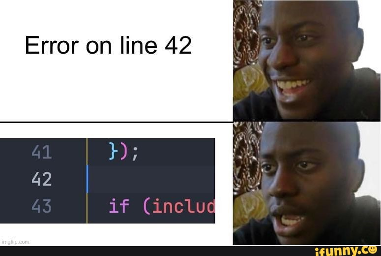
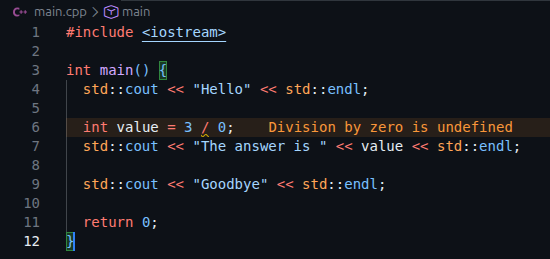

# Chapter 3 - Errors & Warnings

In C++, if you make a mistake in the code, you're gonna know that in 3 different ways:

- Compile Time Error
- Runtime Error
- Warning

---

### Compile Time Error

The main goal of compiling a program is to get an executable binary file `.exe`. Sometimes, you fail to get that binary file because you might have done something wrong in the code. This is a hint for you that there's a mistake in your code.

```cpp
#include <iostream>

int main() {
  std::cout << "Hello" << std::endl
  return 0;
}
```
In this program, I missed a semicolon at the end of the line. That's a big no-no according to the compiler. So, your binary file won't be generated. You'll get an error in your console:
```
main.cpp: In function ‘int main()’:
main.cpp:4:36: error: expected ‘;’ before ‘return’
    4 |   std::cout << "Hello" << std::endl
      |                                    ^
      |                                    ;
    5 |   return 0;
      |   ~~~~~~                            
```
In this error, it's clearly showing that you missed a semicolon.  
But don't you get excited that you'll see all errors like this. Sometimes, you'll get an error like this:

<p align="left">
  
</p>

So, be cautious about making mistakes in your code. Sometimes, it's such a pain in the ass to correct them.

---

### Runtime Error

In these types of errors, the binary file will be generated, and you get to execute your program, but it won't do things as you intended.

```cpp
#include <iostream>

int main() {
  std::cout << "Hello" << std::endl;

  int value = 3 / 0;
  std::cout << "The answer is " << value << std::endl;

  std::cout << "Goodbye" << std::endl;

  return 0;
}
```
In this program, division by zero is performed, which isn't allowed in mathematical terms. When you run this program, the *"Hello"* statement gets printed. After that, the program crashes because of the division-by-zero. *"Goodbye"* statement won't get printed at all because of this.

Compile Time Errors are so much better than these Runtime Errors, if I'm being honest.  
At least, you'll know beforehand that you have a problem in your code.

---

### Warnings

In modern code editors, you'll see some warnings while you are coding. For example, when I was typing this **division-by-zero** program, VSCode warned me that I'm being a bitch.

<p align="left">
  
</p>

These kind of warnings help you before the problem becomes too much of a problem.

---