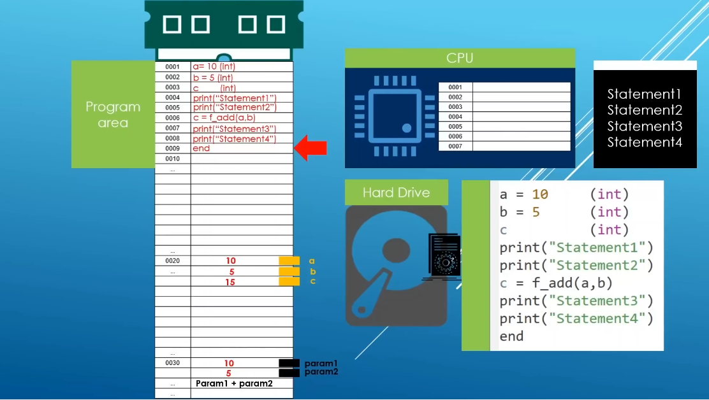

# Chapter 6 - C++ Program Execution Model & Memory Model

### Program Execution Model

You might think you write some code, the computer runs that code. That's it.  
That's not the case, bro. There are so many things happening under the hood.

Imagine I wrote this code in VSCode:
```cpp
#include <iostream>
#include <ostream>

int f_add(int a, int b) { 
  return a + b; 
}

int main() {
  int a = 10;
  int b = 5;
  int c;

  std::cout << "Statement 1" << std::endl;
  std::cout << "Statement 2" << std::endl;
  c = f_add(a, b);
  std::cout << "Statement 3" << std::endl;
  std::cout << "Statement 4" << std::endl;

  return 0;
}
```
This is how it's gonna be executed:


See the hard drive in the image? The compiled program `.exe` is stored here permanently. It's just there. It's not running.

When the program runs, OS copies the instructions from hard drive to RAM. You can see it in the **Program area** section. Each instruction gets a memory address like 0001, 0002, etc.

Look at the addresses:
```
0001  a = 10 (int)
0002  b = 5  (int)
0003  c      (int)
0004  print("Statement1")
0005  print("Statement2")
0006  c = f_add(a,b)
0007  print("Statement3")
0008  print("Statement4")
0009  end
```
This is the code sitting in RAM, each line at its own address, ready to be executed.

The **CPU** doesn't run the whole program at once. It has its own list 0001, 0002, etc. if you see the image. It picks one instruction at a time, fetches it from RAM, executes it, then moves to the next instruction. It's a "line by line" execution.

Notice the 0020 in program area? That's where variables live. That's a different spot in RAM. Instructions and data don't sit in the same block.

That `c = f_add(a, b)` step means CPU fetches `a` value 10 and `b` value 5 from its RAM slots, computes 15 and stores it back into `c`.

This is called *the fetch-execute cycle*. Fetch instruction from RAM, execute it using CPU, move to next instruction, repeat, until it hits the end point.

---

### C++ Memory Model

When a C++ program runs, RAM gets split into 4 parts, each with a specific job.

<br>

1. **Code Segment (Text Segment)**

This is where the actual instructions gets stored. It's read-only, so doesn't change while running. CPU reads from here, one instruction at a time, and executes it.

```cpp
int a = 5;
std::cout << a;
```

This text file gets converted into machine code (0s and 1s) by the compiler. That machine code has to be stored somewhere physically, in RAM, when the program runs. **Code Segment** is that place where the machine code is stored.

<br>

2. **Data Segment**

This is where **global** and **static** variables are stored.

Usually we declare our variables inside the `main()` function, right? But, sometimes people declare them outside `main()` function like this:
```cpp
#include <iostream>

int total = 0;

int main() {
  // some code here
}
```
`total` is a global variable. It's not defined inside any function, so it doesn't die until the end of the program.

<br>

3. **Stack**

This is where **local** variables are stored, which are the variables declared inside a function.

```cpp
int square(int n) {
  int result = n * n;
  return result;
}
```
Here, `n` and `result` only exist while **square()** function is running. The moment it finishes and returns, `n` and `result` are fucking gone. You can't access them anymore from outside. This "only exists while the function is running" behavior, that's what Stack does.

It's a room in RAM that:

- Adds a new little space every time a function starts
- Removes that space automatically the moment the function ends

You never write any code to clean it up, it happens by itself. That's why it's automatic. Think of it like a stack of plates. Last one added is the first one to be removed. You never manually clean this up.

<br>

4. **Heap**

So far we saw that local variables in **Stack** disappear automatically when the function ends. Global/Static variables in **Data segment** live forever. But... **Heap** is different.

**Heap** is a memory where you are the one in control. You decide when it's created and when it's destroyed. Man, it feels so good, right? Having this power. I feel like Walter White saying *"We are done when I say we are done."*

Nothing is automatic here. The memory can be controlled manually using `new` to create, and `delete` to destroy.

```cpp
#include <iostream>
using namespace std;

int main() {
    
  int* ptr = new int(50);              // create space in Heap, store 50 in it

  cout << "Value: " << *ptr << endl;   // access the value using *ptr

  delete ptr;                          // manually free that Heap space

  return 0;
}
```

If you forget to use `delete`, that memory stays reserved forever (until the program fully ends), even though you're done using it. This is called a **memory leak**.

---