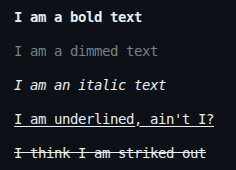

# How to style the text displayed in the output?

Even for this task, we use the same **ANSI escape codes** like we did in the colored text chapter. The same `\033[` at the first and `m` at the end, just different numbers in the middle.

These are called **SGR (Select Graphic Rendition) codes**.

---

This is the format:
```
\033[<code>m
```

In the place of `<code>`, use these:
- `1` for bold text
- `2` for dim text
- `3` for italic text *(not supported everywhere)*
- `4` for underline text
- `9` for strikethrough text

<br>

Let's try each of these and see what it looks like:

```cpp
std::cout << "\033[1m" << "I am a bold text" << "\033[0m" << std::endl;

std::cout << "\033[2m" << "I am a dimmed text" << "\033[0m" << std::endl;

std::cout << "\033[3m" << "I am an italic text" << "\033[0m" << std::endl;

std::cout << "\033[4m" << "I am underlined, ain't I?" << "\033[0m" << std::endl;

std::cout << "\033[9m" << "I think I am striked out" << "\033[0m" << std::endl;
```
The output will be:  



<br>

**NOTE :** Even here, you have to close the styles with `\033[0m` or else the styles will be leaked to the next statements too.

---